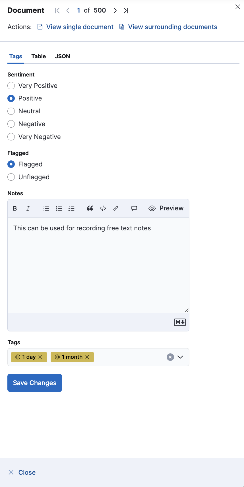

# Annotator

A Kibana Plugin for _annotating_ any document within any index when using Discover. The aim of this plugin is allow simple capture of inputs from end-users without having to leave the Kibana interface. 
Within this context the term _annotations_ refers to the output of a general _labelling_ process,
e.g. inference (machine learning) or human review.  Currently, free text notes, multi-class and multi-label type data maybe captured for each document / record within an index, with the values of these inputs written back to the index via an update query.

The plugin is specified through the standard Kibana config, and creates additional tab(s) within the "flyout" of any Discover data table (alongside the usual _Table_ and _JSON_ field views).
If multiple _annotation fields_ are configured, they will appear within separate tabs, with access control via standard Kibana privileges.

Each annotation field is configured with one or more _tags_,
a _control_ is configured for each tag which determines the input type of the field.

Annotations can be rendered as badges within Discover data tables
by configuring a runtime field which uses the included Custom Field Formatter.


Before attempting to use annotations, each respective index must define a nested mapping for any annotation fields.

> Tested on Kibana 8.17.1, this plugin makes use of Kibana APIs and internals which may change between versions.

This plugin was created based on a demonstrator developed by a consultant at Elastic.

## Features

* **Discover**: Additional tab(s) within the flyout when expanding a document within Discover data tables for managing annotations

 <div align="center">
 
  <p><em>Example Discover flyout</em></p>
</div>

* **Custom Field Format**: Render annotations (as badges) within Discover data table fields
* **Access Control**: General visibility and usage is managed through [Kibana privileges](https://www.elastic.co/guide/en/kibana/current/kibana-privileges.html) under the "Analytics" section

### Roadmap

* Features:
  * **Multiselect**: Apply annotations to multiple documents at the same time
  * **Observers**: Broadcast annotation changes can also be consumed outside Elastic components
  * **Badge Rendering**: Improve the rendering of badges within data tables
* Tests:
  * Unit
  * Functional
  * Accessibility
  * Packaging

## Configuration

A complete configuration example of the plugin for adding to the kibana config, see [deploy/examples/kibana-config.yml](deploy/examples/kibana-config.yml).

The following configuration settings are mandatory:

1. At **least** _one entry_ is required in `docViews` and `annotations`
2. Each `docViews[]` **must** define a `title` and one or more `fields` (corresponding to `annotations[].field`)
   identifying annotation fields to be rendered
3. Each `annotation[]` **must** define a `field` name and at **least** _one entry_ in `tags`

### Doc Views (`docViews`)

One or more tabs to be rendered within a Discover data table Flyout.
Each tab can be configured to render controls for one or more annotation fields:

* `title`: Display name, e.g. "Tags"
* `order`: Horizontal order relative to other tabs registered within the flyout (e.g. "Table" and "JSON")
* `fields`: One or more field names, each corresponding to a `field` defined within `annotations`

### Annotations (`annotations`)

One or more annotation field definitions:

* `name`: Category
* `controlType`: (Optional) Default is multiple
  * `text`: Textarea
  * `switch`: Single selection rendered as a switch toggle
  * `radio`: Single selection rendered as radio options
  * `multiple`: Multiple selections rendered as a combobox
* `color`: Colour for the tag's pill background
* `iconType`: Icon for the category (an EUI icon name)
* `children`: (Optional) List of selection options (using the property `name`), required for `switch`, `radio` and
  `multiple` annotation types

### Misc

* `debug`: (Optional) Controls the verbosity of console logging within UI components, defaults to `false` when Kibana is
  not running in dev mode

## Field Mapping

All annotation fields **must** be explicitly mapped within indexes, for
example [deploy/examples/index-mapping.json](deploy/examples/index-mapping.json).

Due to limited support within Discover for rendering nested field types,
a runtime field should be added for any annotation fields within corresponding Data Views:

* Name: A valid field name, e.g. `tags`
* Custom Label: A display name, e.g. "Tags"
* Type: Keyword
* Value: Painless script to serialise the nested annotations
  field [deploy/examples/annotations-runtime-field-script.java](deploy/examples/annotations-runtime-field-script.java)
* Format: Select "_Annotations_" (a custom formatter provided by this plugin)

When configuring multiple annotation fields, they must each have their own corresponding field and runtime mappings.

---

## Development

See the [kibana contributing guide](https://github.com/elastic/kibana/blob/main/CONTRIBUTING.md) for instructions
setting up your development environment.

When developing and testing locally, configuration of Security is usually required to ensure an appropriate Elastic role for saving updates to documents.

### Plugin Setup

Firstly, place the contents of this repository within the `plugins` directory of Kibana.

Configure the environment to use the same node version as Kibana:

```shell
nvm use
```

Install and configure dependencies such as `node_modules`:

```shell
yarn kbn bootstrap
```

Automatically generate the UI artefacts of the plugin during development:

```shell
yarn plugin-helpers dev --watch
```

If not done so already, follow the [Configuration](#configuration) section above to correctly specify the plugin configuration.

Kibana can now be started as normal.

## Deploy

Build a distributable archive containing the plugin artefacts:

```shell
kibana_version="8.17.1"
yarn build --kibana-version "$kibana_version"
```

Next, build a custom Kibana container image which has this plugin (along with any others you need) already installed.
The example [Dockerfile](Dockerfile) correctly installs this plugin as layer onto top of the standard Kibana image:

```shell
docker build -t "kibana/kibana:${kibana_version}_custom" .
```

Tag and push the image to your chosen image registry.
The example [push-image.sh](push-image.sh) targets AWS ECR,
before running make sure credentials are valid and a default profile has been set:

```shell
./push-image.sh
```

Alternatively, when creating an image bundled with multiple custom plugins, use the distributable package.

## Design

## Architecture

### UI

For each configured annotation field,
renders custom React component `DocViewerAnnotations` to a new tab registered within the `UnifiedDocViewer` flyout.

> The current method of registering additional `DocView`s to the `UnifiedDocViewer` may break between Kibana versions.

The `DocViewerAnnotations` component renders form controls for the annotation field based on the plugin configuration,
if present, values are populated from the currently selected document.
On form submission,
the annotation field value is sent (REST API) to the server-side components,
on success a page refresh is forced to ensure the page reflects the updated annotation field.

### Server

TBC

## Dependencies

* `@kbn/unified-doc-viewer-plugin/public`: Render additional tabs within the flyout corresponding to each annotation
  field
* `@kbn/field-formats-plugin/public`: Custom Field Formatter for annotation fields
* `@kbn/features-plugin/public`: Fine-grained access control over each annotation field

## License

Unless stated otherwise, the contents of this repository have been released under the following conditions:

* Code (including any example code) under [MIT License](https://opensource.org/licenses/MIT)
* Documentation under [Open Government License v3.0](https://www.nationalarchives.gov.uk/doc/open-government-licence/version/3/)
* Crown Copyright 2025, National Crime Agency (NCA)
